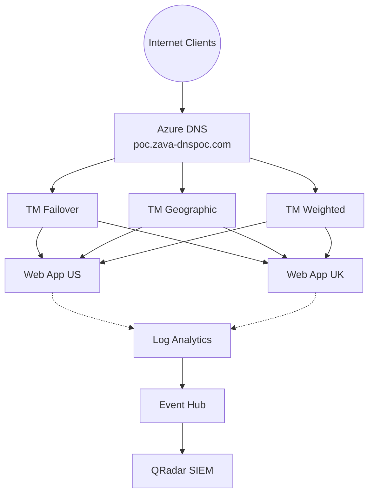

# Azure DNS POC — Solution Accelerator

> **Ship an Azure DNS proof of concept in a single session — not a single sprint.**

Production-grade, repeatable deployment kit that stands up a complete Azure DNS environment — public and private zones, DNSSEC, multi-region Traffic Manager (failover, geographic, weighted), Event Hub integration for IBM QRadar SIEM, RBAC with custom roles, DigiCert DCV certificate automation, zone snapshots, and Log Analytics dashboards — all in one command.

**35 resources. 3 deployment paths. 12 Bicep modules. 0 guesswork.**

Built from a live customer engagement (Zava Energy Corporation), battle-tested with 14 deployment findings fixed, and parameterized so any Microsoft account team can clone, customize, and deploy for their next Azure DNS competitive evaluation.

**Latest Update (March 31, 2026):** **Push-Button E2E + Let's Encrypt** — New `Zava_DNS_POC_E2E.ps1` provides single-command deployment (domain purchase → DNSSEC → Let's Encrypt cert → Key Vault import). All 3 deployment paths now support feature flags: `ENABLE_PRIVATE_DNS`, `ENABLE_DOMAIN_PURCHASE`, `ENABLE_LETSENCRYPT`, `ENABLE_DNSSEC_SUBDOMAIN`. Private DNS zone is now optional. DNSSEC works via child zone approach (workaround for App Service Domain DS limitation). Free TLS certs via Let's Encrypt DNS-01 challenge with `certbot-dns-azure`.

**Security Update (March 29, 2026):** Key Vault integration across all 3 deployment methods (Bicep, PowerShell, Bash) — connection strings for Event Hub and Storage Account now automatically stored in Key Vault during deployment. Zero secrets exposed in outputs or console logs. All scripts include `az keyvault secret show` retrieval instructions.

| | |
|---|---|
| **Deployment Options** | Bicep (IaC), PowerShell (step-by-step), Bash (az CLI), **E2E push-button** |
| **Time to Deploy** | ~15 minutes (Bicep) · ~45 minutes (manual step-by-step) |
| **Estimated POC Cost** | ~$27 for a 2-week evaluation ([API-verified pricing](#cost-estimate)) |
| **Target Region** | `southcentralus` (configurable) |
| **Security Posture** | Least-privilege RBAC, HTTPS-only, TLS 1.2, CanNotDelete locks, **Zero-secret deployments**, **Key Vault integration (DCV automation)** |

---

## What's in This Repo

### Deployment Scripts

| File | Lines | Purpose | Last Updated |
|------|-------|---------|-------------|
| **Zava_DNS_POC_E2E.ps1** | 900+ | **NEW:** Push-button end-to-end: domain purchase → Bicep → DNSSEC → Let's Encrypt → validation | ✅ Mar 31: **New** |
| **letsencrypt-cert.sh** | 280+ | **NEW:** Standalone Let's Encrypt cert automation (staging → prod → Key Vault import) | ✅ Mar 31: **New** |
| **Zava_DCV_Automation.ps1** | 600+ | DCV certificate automation — closes 5 identified gaps (Service Principal, Key Vault, renewal scaffold) with **zero-secret Key Vault integration**. Customer provides DigiCert API key. | ✅ Mar 29: **Gap 1+3 Implemented** |
| **Zava_DNS_POC_Deployment.ps1** | 2,000+ | PowerShell end-to-end deployment (16 sections). Feature flags for domain purchase, Let's Encrypt, private DNS, DNSSEC subdomain. | ✅ Mar 31: **Backport** |
| **Zava_DNS_POC_Runbook.sh** | 2,100+ | Bash/az CLI runbook (13 sections). Same feature flags + 9-test DCV proof suite. | ✅ Mar 31: **Backport** |
| **cert-renewal-runbook.ps1** | — | Auto-generated by Zava_DCV_Automation.ps1 — renewal scaffold with secure Key Vault credential retrieval patterns | Generated file |
| **Zava_RBAC_Delegation.ps1** | 500+ | **NEW:** Standalone RBAC script — creates custom DNS Record Operator role, assigns to test users, runs 7 verification tests, applies resource lock, shows audit trail | ✅ Apr 1 |

### DCV Certificate Automation

| File | Purpose |
|------|---------|  
| **Zava_DCV_Automation.ps1** | PowerShell script closing 5 DCV gaps — creates service principal with DNS RBAC, deploys Key Vault with RBAC, stores credentials securely (zero-secret pattern), generates cert renewal runbook with Key Vault retrieval | ✅ **Gap 1+3 Implemented** |
| **DCV_Gap_Analysis.md** | Gap analysis: what's missing from POC for production cert automation (service identity, issuance, storage, renewal, DigiCert integration) |  
| **Zava_DCV_Walkthrough_Guide.md** | Step-by-step DCV walkthrough for customer (Jeremy, Matt) — explains Domain Control Validation, certificate workflows |

### Bicep Infrastructure-as-Code

| Path | Purpose |
|------|---------|
| **infrastructure/main.bicep** | Subscription-scope Bicep template — deploys all 35 resources declaratively | ✅ **Key Vault secrets** |
| **infrastructure/modules/key-vault-secrets.bicep** | Key Vault secrets module (NEW) | ✅ **Auto-stores connection strings** |
| **infrastructure/main.bicepparam** | Parameters file (Bicep native format) | ✅ Fixed syntax |
| **infrastructure/main.parameters.json** | Parameters file (JSON alternative) | ✅ Schema updated |
| **infrastructure/deploy.ps1** | Automated Bicep deployment script (validate / what-if / deploy) | |
| **infrastructure/modules/** | 13 reusable Bicep modules (DNS, Event Hub, TM, Web Apps, Key Vault, Secrets) | ✅ Linting clean |
| **infrastructure/README.md** | Bicep deployment guide |
| **infrastructure/QUICK_REFERENCE.md** | Operator command cheat sheet |

### Documentation

| File | Purpose |
|------|---------|
| **DNS_POC_Architecture.drawio** | Architecture diagram (open in draw.io or VS Code draw.io extension) |
| **DNS_POC_Solution_Accelerator_Discovery.md** | Discovery document — kimvaddi.com reference analysis + gap mapping |
| **Zava_Azure_DNS_POC_Plan.md** | Full POC scope, 3-phase timeline, success scorecard, competitive positioning |
| **Zava_DCV_Walkthrough_Guide.md** | Beginner-friendly DCV + certificate workflow guide |
| **DNS_POC_Core Ask from the Customer.txt** | Raw customer requirements (source of truth) |
| **Zava DNS POC Scope _3_25_2026.txt** | Workstream catalog from scoping session |
| **sample-bind-zone.txt** | Sample Bind zone file (RFC 1035) with all record types |
| **.github/copilot-instructions.md** | Copilot workspace instructions |

### Local Directories (gitignored)

| Path | Purpose |
|------|---------|
| **./zone-files/** | Customer's exported Bind zone files (place here before import) |
| **./zone-snapshots/** | Zone export snapshots (on-demand + scheduled) |

---

## Three Deployment Options

### Option 1: Push-Button E2E (NEW — Recommended)

```powershell
# Single command: domain → infra → DNSSEC → Let's Encrypt → validate
.\Zava_DNS_POC_E2E.ps1 -Phase All

# Or phase by phase
.\Zava_DNS_POC_E2E.ps1 -Phase Domain     # Buy domain + child zone
.\Zava_DNS_POC_E2E.ps1 -Phase Infra       # Bicep infrastructure
.\Zava_DNS_POC_E2E.ps1 -Phase DNSSEC      # Sign zone + publish DS
.\Zava_DNS_POC_E2E.ps1 -Phase Cert        # Let's Encrypt cert
.\Zava_DNS_POC_E2E.ps1 -Phase Validate    # 12-test validation suite
```

### Option 2: PowerShell (Step-by-Step — Tested Live)

```powershell
# 1. Edit Section 0 variables
code Zava_DNS_POC_Deployment.ps1

# 2. Place Bind zone files in ./zone-files/

# 3. Run section by section (copy-paste into PowerShell)
# Each section has a VERIFY step — confirm before moving on
```

### Option 3: Bash / az CLI

```bash
# 1. Edit Section 0 variables (including feature flags)
vim Zava_DNS_POC_Runbook.sh

# 2. Run section by section
# Includes 9-test DCV proof suite with automated PASS/FAIL
# NEW: Set ENABLE_LETSENCRYPT=true for cert automation
```

### Option 4: Bicep (Infrastructure-as-Code)

```powershell
# 1. Edit parameters
code infrastructure/main.bicepparam

# 2. Validate
cd infrastructure
.\deploy.ps1 -ValidateOnly

# 3. Deploy
.\deploy.ps1
```

### Clean Up (any option)

```powershell
.\Zava_DNS_POC_Cleanup.ps1
# Type 'DELETE' when prompted
```

---

## What Gets Deployed (35 Resources)

```
Resource Group: rg-dns-poc
├── Azure DNS Zone (public) + DNSSEC + CanNotDelete lock
├── Private DNS Zone + VNet Link + 3 sample records (optional — ENABLE_PRIVATE_DNS)
├── VNet (10.0.0.0/16) (optional — only with private DNS)
├── Event Hub (Standard SKU) + Send/Listen policies + qradar-consumer group
├── Storage Account (QRadar checkpoint tracking)
├── Log Analytics Workspace (30-day retention)
├── Traffic Manager × 3 (Priority, Geographic, Weighted)
├── App Service Plan × 2 (West US 3, East Asia)
├── Web App × 2 (dotnet:8, httpsOnly, FTPS disabled, TLS 1.2)
├── Custom RBAC role (DNS Record Operator)
├── Event Hub RBAC (Data Sender + Data Receiver)
├── Subscription diagnostic settings (Activity Log → Event Hub + LAW, 8 categories)
├── Resource diagnostic settings (Web Apps 7 categories + TM ProbeHealth → LAW)
├── Custom domain + TLS binding (after NS delegation)
└── Optional: Azure Front Door (commented out)
```

---

## POC Scope Coverage

### Required (All Must Pass)

| # | Workstream | PS Section | Bash Section | Bicep | Tested? |
|---|-----------|-----------|-------------|-------|---------|
| 1 | Zone Migration (Bind import) | Section 1.4 | Section 2 | DNS zone only | ✅ 23/23 records |
| 2 | Audit Logging (→ Event Hub → QRadar) | Section 3 | Section 6 | ✅ Full | ✅ 8 categories |

> **DNS Logging Limitation:** Azure DNS public zones do NOT support per-query logging (data plane).
> The Activity Log captures management plane operations only: WHO changed WHAT record, WHEN, from WHERE.
> It does NOT capture: who queried what record (DNS query traffic).
> This is an Azure platform limitation — not a POC gap. For per-query DNS logging, consider:
> - [Azure DNS Private Resolver + DNS Security Policy](https://learn.microsoft.com/azure/dns/dns-traffic-log-how-to) — enables `DNSQueryLogs` for VNet traffic
> - [Azure Firewall DNS Proxy](https://learn.microsoft.com/azure/firewall/dns-details) — logs all DNS queries through the firewall
> - **Ref:** [Monitor Azure DNS](https://learn.microsoft.com/azure/dns/monitor-dns) | [Activity Log](https://learn.microsoft.com/azure/azure-monitor/essentials/activity-log) | [DNS Security Baseline](https://learn.microsoft.com/security/benchmark/azure/baselines/azure-dns-security-baseline)
| 3 | Reporting (LAW + Workbooks) | Section 7.5 | Section 8 | ✅ LAW + diag | ✅ |
| 4 | Zone Snapshots (export + re-import) | Section 8 | Section 7 | N/A (procedural) | ✅ |
| 5 | Certificate Integration (DCV) | Section 5 | Section 5 | N/A (procedural) | ✅ 5/9 tests |

### Optional

| # | Workstream | PS Section | Bash Section | Bicep | Tested? |
|---|-----------|-----------|-------------|-------|---------|
| 6 | DNS Failover | Section 6+7 | Section 9 | ✅ TM Priority | ✅ |
| 7 | Weighted Load Balancing | Section 6+7 | Section 10.3 | ✅ TM Weighted | ✅ |
| 8 | Geographic DNS | Section 6+7 | Section 10.2 | ✅ TM Geographic | ✅ |
| 9 | API Support (CRUD) | Section 2.7 | Section 5.1 | Bicep examples | ✅ |
| 10 | DNSSEC | Section 9 | Section 10.1 | N/A (experimental CLI) | ✅ |

---

## Deployment Findings (14 Issues Found & Fixed)

See the PowerShell script header for the complete list. Key findings:

1. Azure DNS public zones **do not support query-level logging** (management plane only)
2. Event Hub **must be Standard SKU** (Basic doesn't support consumer groups/SAS policies)
3. QRadar needs **4 Azure resources** per Microsoft's SIEM guide
4. CNAME TTL defaults to **3600s** — must be set to **30s** for fast failover
5. Web apps default to **httpsOnly=false** and **ftpsState=FtpsOnly** — must harden
6. Custom domain binding requires **NS delegation + asuid TXT verification** first
7. `RootManageSharedAccessKey` **cannot be deleted** — rotate + use dedicated policies
8. **Managed Identity + RBAC** for Event Hub where possible (SAS still required for diagnostic settings + QRadar)

---

## Architecture



---

## Customization

Edit Section 0 (PowerShell/Bash) or parameters file (Bicep):

| Parameter | Default | Customer Sets |
|-----------|---------|--------------|
| `$DOMAIN` / `domain` | poc.zava-dnspoc.com | ✅ |
| `$RG_NAME` / `rgName` | rg-dns-poc | ✅ |
| `$LOCATION_PRIMARY` / `locationPrimary` | westus3 | ✅ |
| `$LOCATION_SECONDARY` / `locationSecondary` | westeurope | ✅ |
| `$EH_NAMESPACE` | ehns-dns-poc | ✅ |
| `$WEBAPP_US` / `webAppNameUS` | webapp-poc-us | ✅ |
| `$WEBAPP_UK` / `webAppNameUK` | webapp-poc-uk | ✅ |
| `$ZONE_FILE_1` | ./zone-files/Zava-zone1.zone | ✅ |
| `$ZONE_FILE_2` | ./zone-files/Zava-zone2.zone | ✅ |
| `$SNAPSHOT_DIR` | ./zone-snapshots | ✅ |

---

## Cost Estimate

**14-day POC — prices from [Azure Retail Prices API](https://prices.azure.com) (March 2026):**

| Resource | Unit Price | 14-Day Cost |
|----------|-----------|-------------|
| Public DNS Zone (1) | $0.50/zone/mo | $0.23 |
| Private DNS Zone (1) | $0.50/zone/mo | $0.23 |
| Event Hub Standard (1 TU) | $0.03/hr | $10.08 |
| App Service Plan B1 x 2 | $0.02/hr each | $13.44 |
| Log Analytics (~0.5 GB) | $2.76/GB | $1.38 |
| Traffic Manager (3 profiles, 6 endpoints) | $0.36/ep/mo | $1.01 |
| DNS Queries, Storage, VNet, RBAC, Locks | — | $0.00 |
| **TOTAL** | | **~$26.37** |

---

## DCV Certificate Automation

The POC includes automated Domain Control Validation testing (9 proof tests) plus a DCV gap remediation script that adds production-readiness for cert lifecycle automation.

### Quick Start
```powershell
# Run all implementable gaps (1, 3, 4) — skip customer-dependent gaps
.\Zava_DCV_Automation.ps1 -SkipCustomerDependentGaps

# Run individual gaps
.\Zava_DCV_Automation.ps1 -RunGap Gap1   # Service Principal
.\Zava_DCV_Automation.ps1 -RunGap Gap3   # Key Vault
.\Zava_DCV_Automation.ps1 -RunGap Gap4   # Renewal runbook scaffold
.\Zava_DCV_Automation.ps1 -RunGap Gap2   # DigiCert (needs customer input)
```

### Customer Prerequisites for Full DCV Automation

| Item | Provider | When |
|---|---|---|
| DigiCert CertCentral API key | Customer (DigiCert admin) | Before cert issuance testing |
| DigiCert Organization ID | Customer | Before cert issuance testing |
| Real domain with NS delegation to Azure DNS | Customer (registrar) | Before live DCV testing |
| Approval to create Entra service principal | Customer platform team | Before SP creation in prod |
| certbot on Linux host (optional) | Customer | For ACME-based automation |

---

## Security

- Least-privilege SAS policies (Send/Listen separated, never root key in app code)
- Custom RBAC role (DNS Record Operator — records only, no zone create/delete)
- RBAC-based Event Hub access (Azure Event Hubs Data Sender/Receiver)
- HTTPS-only web apps, FTP disabled, TLS 1.2 minimum
- Resource lock on DNS zone (CanNotDelete)
- Root SAS key rotated post-deployment
- 10-item production hardening checklist in script
- Managed Identity path documented for Azure-native consumers

### RBAC Role Model — DNS Access Control

The POC implements a **two-role model** for DNS access control, following MS Learn least-privilege guidance:

| | Admin (DNS Zone Contributor) | Operator (DNS Record Operator) |
|---|---|---|
| **Type** | Built-in (Microsoft-managed) | **Custom** (created by script) |
| **Scope** | Resource Group (all zones) | Individual DNS Zone |
| **Create/delete zones** | ✅ | ❌ |
| **Import/export zones** | ✅ | ❌ |
| **Create A/AAAA/CNAME/MX/TXT/SRV/CAA/PTR** | ✅ | ✅ |
| **Update/delete records** | ✅ | ✅ |
| **Modify SOA/NS records** | ✅ | ❌ |
| **Enable DNSSEC** | ✅ | ❌ |
| **Read zones + records** | ✅ | ✅ |

**Custom Role Definition:** [dns-operator-role.json](dns-operator-role.json)

```
Actions (CAN do):                          NotActions (CANNOT do):
 Microsoft.Network/dnsZones/read            Microsoft.Network/dnsZones/write
 Microsoft.Network/dnsZones/*/read          Microsoft.Network/dnsZones/delete
 Microsoft.Network/dnsZones/A/*             Microsoft.Network/dnsZones/SOA/write
 Microsoft.Network/dnsZones/AAAA/*          Microsoft.Network/dnsZones/NS/write
 Microsoft.Network/dnsZones/CNAME/*         Microsoft.Network/dnsZones/NS/delete
 Microsoft.Network/dnsZones/MX/*            Microsoft.Network/dnsZones/dnssecConfigs/*/write
 Microsoft.Network/dnsZones/TXT/*           Microsoft.Network/dnsZones/dnssecConfigs/*/delete
 Microsoft.Network/dnsZones/SRV/*
 Microsoft.Network/dnsZones/CAA/*
 Microsoft.Network/dnsZones/PTR/*
 Microsoft.Network/dnsZones/recordsets/read
 Microsoft.Resources/.../resourceGroups/read
```

**Standalone script:** `Zava_RBAC_Delegation.ps1` — creates role, assigns to test users, runs verification tests, applies resource lock.

**MS Learn References:**
- [Protect DNS zones and records](https://learn.microsoft.com/azure/dns/dns-protect-zones-recordsets)
- [Secure your DNS deployment](https://learn.microsoft.com/azure/dns/secure-dns)
- [Custom RBAC roles](https://learn.microsoft.com/azure/role-based-access-control/custom-roles)

---

## Changelog

### March 29, 2026 — Key Vault Integration & Secret Management

**🔒 MAJOR SECURITY ENHANCEMENT: Zero-Secret Deployments**
- ✅ All connection strings now stored in Azure Key Vault (Bicep, PowerShell, Bash)
- ✅ No secrets exposed in deployment outputs or console logs
- ✅ Automatic RBAC-based Key Vault access configuration
- ✅ Secrets Officer role granted to deployer automatically
- ✅ Secure retrieval instructions provided for SIEM teams
- ✅ Sensitive variables cleared from memory after storage

**Bicep Infrastructure**
- ✅ Created key-vault-secrets.bicep module for automatic secret storage
- ✅ Event Hub Send/Listen connection strings stored in Key Vault
- ✅ Storage Account connection string stored in Key Vault
- ✅ Removed connection string outputs (replaced with Key Vault references)
- ✅ Output secret names and Key Vault URI (not secret values)

**PowerShell Deployment Script**
- 🔑 Key Vault created automatically in Section 0 (Foundation)
- 🔑 Connection strings retrieved and stored in Key Vault (never displayed)
- 🔑 Secure retrieval instructions with RBAC guidance
- 🔑 Variables cleared from memory after storage

**Bash Deployment Script**
- 🔑 Key Vault created in Section 1 (Environment Setup)
- 🔑 Connection strings stored in Key Vault with error handling
- 🔑 Summary section updated with Key Vault retrieval commands
- 🔑 `unset` used to clear sensitive variables

**Impact:** **PRODUCTION-READY SECRET MANAGEMENT** — All deployment methods now follow zero-trust security principles with centralized secret storage and RBAC-based access control.

---

### March 29, 2026 — Security & Code Quality Improvements

**Bicep Infrastructure**
- ✅ Added `@secure()` decorator to all connection string outputs (event-hub.bicep, main.bicep)
- ✅ Modernized Traffic Manager endpoint properties with safe access operator `.?` (traffic-manager.bicep)
- ✅ Removed unused `resourceType` parameter from resource lock module
- ✅ Fixed `.bicepparam` syntax errors (removed invalid `subscription()` calls)
- ✅ Updated JSON schema to 2019-04-01 standard (main.parameters.json)
- ✅ All Bicep linting warnings resolved — production-ready

**PowerShell Deployment Script**
- ⚠️ Added prominent security warnings before connection string output
- 🔐 Documented Key Vault storage recommendations for secrets
- 📖 Enhanced SAS vs Managed Identity guidance with security best practices
- 🚫 Added warnings about never logging secrets in CI/CD pipelines

**Bash Deployment Script**
- ✅ Fixed deprecated `--message-retention` flag → `--retention-time-in-hours 24 --cleanup-policy Delete`
- ⚠️ Added security warnings before outputting sensitive credentials
- 🔐 Documented Key Vault integration patterns
- 📖 Improved SIEM configuration instructions with security context

**Impact:** All deployment methods now follow Azure security best practices with proper secret handling, modern Bicep syntax, and comprehensive inline security documentation.

---

## Git History

```
1258395 Complete rebrand: rename Scoping Agenda + replace all Valero with Zava
9fddb19 Remove pre-rebrand Valero_DNS_POC_Runbook.sh (deleted from disk)
97695ec Rebrand: Valero -> Zava (all files, filenames, and content)
b74d8a2 Add Bicep infrastructure (12 modules) + DCV walkthrough update
d3ae222 Remove runbook.sh from git tracking
00b4223 Update README: 3 deployment options, current file inventory, 14 findings
f428937 Remove scoping session agenda from git tracking (customer-specific)
8d60609 Zone snapshots: export to ./zone-snapshots/ directory
4cd1a13 Zone import: multi-file local paths instead of user prompt
c842771 Azure DNS POC Solution Accelerator - Production-grade deployment kit
```

---

## Author

**Kim Vaddi** — Microsoft Account Team  
Built with GitHub Copilot, March 2026  
Tested in subscription: MCAPS-Hybrid-REQ-118274-2025-kimvaddi  
Reference architecture: kimvaddi.com (DNSdemo resource group)

---

## License

This is an internal Microsoft engagement accelerator. Not intended for redistribution outside Microsoft account teams without approval.
