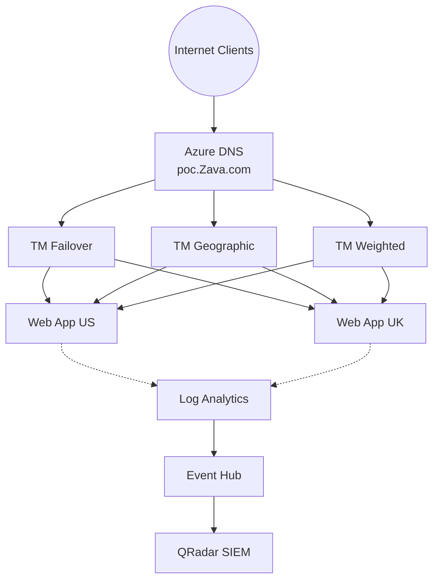

# Azure DNS POC — Solution Accelerator

> **Ship an Azure DNS proof of concept in a single session — not a single sprint.**

Production-grade, repeatable deployment kit that stands up a complete Azure DNS environment — public and private zones, DNSSEC, multi-region Traffic Manager (failover, geographic, weighted), Event Hub integration for IBM QRadar SIEM, RBAC with custom roles, DigiCert DCV certificate automation, zone snapshots, and Log Analytics dashboards — all in one command.

**35 resources. 3 deployment paths. 12 Bicep modules. 0 guesswork.**

Built from a live customer engagement (Zava Energy Corporation), battle-tested with 14 deployment findings fixed, and parameterized so any Microsoft account team can clone, customize, and deploy for their next Azure DNS competitive evaluation.

| | |
|---|---|
| **Deployment Options** | Bicep (IaC), PowerShell (step-by-step), Bash (az CLI) |
| **Time to Deploy** | ~15 minutes (Bicep) · ~45 minutes (manual step-by-step) |
| **Estimated POC Cost** | < $25 for a 2-week evaluation |
| **Target Region** | `southcentralus` (configurable) |
| **Security Posture** | Least-privilege RBAC, HTTPS-only, TLS 1.2, CanNotDelete locks, SAS key rotation |

---

## What's in This Repo

### Deployment Scripts

| File | Lines | Purpose |
|------|-------|---------|
| **Zava_DNS_POC_Deployment.ps1** | 1,639 | PowerShell end-to-end deployment (16 sections). Tested live with 14 findings fixed. |
| **Zava_DNS_POC_Runbook.sh** | 1,800+ | Bash/az CLI runbook (13 sections). Includes 9-test DCV proof suite with PASS/FAIL verdicts. |
| **Zava_DNS_POC_Cleanup.ps1** | 182 | Tear-down script. Dependency-ordered cleanup (locks → DNSSEC → RBAC → RG). |

### Bicep Infrastructure-as-Code

| Path | Purpose |
|------|---------|
| **infrastructure/main.bicep** | Subscription-scope Bicep template — deploys all 35 resources declaratively |
| **infrastructure/main.bicepparam** | Parameters file (Bicep native format) |
| **infrastructure/main.parameters.json** | Parameters file (JSON alternative) |
| **infrastructure/deploy.ps1** | Automated Bicep deployment script (validate / what-if / deploy) |
| **infrastructure/modules/** | 12 reusable Bicep modules (DNS, Event Hub, TM, Web Apps, etc.) |
| **infrastructure/README.md** | Bicep deployment guide |
| **infrastructure/QUICK_REFERENCE.md** | Operator command cheat sheet |

### Documentation

| File | Purpose |
|------|---------|
| **DNS_POC_Architecture.drawio** | Architecture diagram (open in draw.io or VS Code draw.io extension) |
| **DNS_POC_Solution_Accelerator_Discovery.md** | Discovery document — kimvaddi.com reference analysis + gap mapping |
| **Zava_Azure_DNS_POC_Plan.md** | Full POC scope, 3-phase timeline, success scorecard, competitive positioning |
| **Zava_DCV_Walkthrough_Guide.md** | Beginner-friendly DCV + certificate workflow guide |
| **DNS_POC_Core Ask from the Customer.txt** | Raw customer requirements (source of truth) |
| **Zava DNS POC Scope _3_25_2026.txt** | Workstream catalog from scoping session |
| **sample-bind-zone.txt** | Sample Bind zone file (RFC 1035) with all record types |
| **.github/copilot-instructions.md** | Copilot workspace instructions |

### Local Directories (gitignored)

| Path | Purpose |
|------|---------|
| **./zone-files/** | Customer's exported Bind zone files (place here before import) |
| **./zone-snapshots/** | Zone export snapshots (on-demand + scheduled) |

---

## Three Deployment Options

### Option 1: PowerShell (Recommended — Tested Live)

```powershell
# 1. Edit Section 0 variables
code Zava_DNS_POC_Deployment.ps1

# 2. Place Bind zone files in ./zone-files/

# 3. Run section by section (copy-paste into PowerShell)
# Each section has a VERIFY step — confirm before moving on
```

### Option 2: Bash / az CLI

```bash
# 1. Edit Section 0 variables
vim Zava_DNS_POC_Runbook.sh

# 2. Run section by section
# Includes 9-test DCV proof suite with automated PASS/FAIL
```

### Option 3: Bicep (Infrastructure-as-Code)

```powershell
# 1. Edit parameters
code infrastructure/main.bicepparam

# 2. Validate
cd infrastructure
.\deploy.ps1 -ValidateOnly

# 3. Deploy
.\deploy.ps1
```

### Clean Up (any option)

```powershell
.\Zava_DNS_POC_Cleanup.ps1
# Type 'DELETE' when prompted
```

---

## What Gets Deployed (35 Resources)

```
Resource Group: rg-dns-poc
├── Azure DNS Zone (public) + DNSSEC + CanNotDelete lock
├── Private DNS Zone + VNet Link + 3 sample records
├── VNet (10.0.0.0/16)
├── Event Hub (Standard SKU) + Send/Listen policies + qradar-consumer group
├── Storage Account (QRadar checkpoint tracking)
├── Log Analytics Workspace (30-day retention)
├── Traffic Manager × 3 (Priority, Geographic, Weighted)
├── App Service Plan × 2 (West US 3, East Asia)
├── Web App × 2 (dotnet:8, httpsOnly, FTPS disabled, TLS 1.2)
├── Custom RBAC role (DNS Record Operator)
├── Event Hub RBAC (Data Sender + Data Receiver)
├── Subscription diagnostic settings (Activity Log → Event Hub + LAW, 8 categories)
├── Resource diagnostic settings (Web Apps 7 categories + TM ProbeHealth → LAW)
├── Custom domain + TLS binding (after NS delegation)
└── Optional: Azure Front Door (commented out)
```

---

## POC Scope Coverage

### Required (All Must Pass)

| # | Workstream | PS Section | Bash Section | Bicep | Tested? |
|---|-----------|-----------|-------------|-------|---------|
| 1 | Zone Migration (Bind import) | Section 1.4 | Section 2 | DNS zone only | ✅ 23/23 records |
| 2 | Audit Logging (→ Event Hub → QRadar) | Section 3 | Section 6 | ✅ Full | ✅ 8 categories |
| 3 | Reporting (LAW + Workbooks) | Section 7.5 | Section 8 | ✅ LAW + diag | ✅ |
| 4 | Zone Snapshots (export + re-import) | Section 8 | Section 7 | N/A (procedural) | ✅ |
| 5 | Certificate Integration (DCV) | Section 5 | Section 5 | N/A (procedural) | ✅ 5/9 tests |

### Optional

| # | Workstream | PS Section | Bash Section | Bicep | Tested? |
|---|-----------|-----------|-------------|-------|---------|
| 6 | DNS Failover | Section 6+7 | Section 9 | ✅ TM Priority | ✅ |
| 7 | Weighted Load Balancing | Section 6+7 | Section 10.3 | ✅ TM Weighted | ✅ |
| 8 | Geographic DNS | Section 6+7 | Section 10.2 | ✅ TM Geographic | ✅ |
| 9 | API Support (CRUD) | Section 2.7 | Section 5.1 | Bicep examples | ✅ |
| 10 | DNSSEC | Section 9 | Section 10.1 | N/A (experimental CLI) | ✅ |

---

## Deployment Findings (14 Issues Found & Fixed)

See the PowerShell script header for the complete list. Key findings:

1. Azure DNS public zones **do not support query-level logging** (management plane only)
2. Event Hub **must be Standard SKU** (Basic doesn't support consumer groups/SAS policies)
3. QRadar needs **4 Azure resources** per Microsoft's SIEM guide
4. CNAME TTL defaults to **3600s** — must be set to **30s** for fast failover
5. Web apps default to **httpsOnly=false** and **ftpsState=FtpsOnly** — must harden
6. Custom domain binding requires **NS delegation + asuid TXT verification** first
7. `RootManageSharedAccessKey` **cannot be deleted** — rotate + use dedicated policies
8. **Managed Identity + RBAC** for Event Hub where possible (SAS still required for diagnostic settings + QRadar)

---

## Architecture



---

## Customization

Edit Section 0 (PowerShell/Bash) or parameters file (Bicep):

| Parameter | Default | Customer Sets |
|-----------|---------|--------------|
| `$DOMAIN` / `domain` | poc.Zava.com | ✅ |
| `$RG_NAME` / `rgName` | rg-dns-poc | ✅ |
| `$LOCATION_PRIMARY` / `locationPrimary` | westus3 | ✅ |
| `$LOCATION_SECONDARY` / `locationSecondary` | eastasia | ✅ |
| `$EH_NAMESPACE` | ehns-dns-poc | ✅ |
| `$WEBAPP_US` / `webAppNameUS` | webapp-poc-us | ✅ |
| `$WEBAPP_UK` / `webAppNameUK` | webapp-poc-uk | ✅ |
| `$ZONE_FILE_1` | ./zone-files/Zava-zone1.zone | ✅ |
| `$ZONE_FILE_2` | ./zone-files/Zava-zone2.zone | ✅ |
| `$SNAPSHOT_DIR` | ./zone-snapshots | ✅ |

---

## Security

- Least-privilege SAS policies (Send/Listen separated, never root key in app code)
- Custom RBAC role (DNS Record Operator — records only, no zone create/delete)
- RBAC-based Event Hub access (Azure Event Hubs Data Sender/Receiver)
- HTTPS-only web apps, FTP disabled, TLS 1.2 minimum
- Resource lock on DNS zone (CanNotDelete)
- Root SAS key rotated post-deployment
- 10-item production hardening checklist in script
- Managed Identity path documented for Azure-native consumers

---

## Git History

```
1258395 Complete rebrand: rename Scoping Agenda + replace all Valero with Zava
9fddb19 Remove pre-rebrand Valero_DNS_POC_Runbook.sh (deleted from disk)
97695ec Rebrand: Valero -> Zava (all files, filenames, and content)
b74d8a2 Add Bicep infrastructure (12 modules) + DCV walkthrough update
d3ae222 Remove runbook.sh from git tracking
00b4223 Update README: 3 deployment options, current file inventory, 14 findings
f428937 Remove scoping session agenda from git tracking (customer-specific)
8d60609 Zone snapshots: export to ./zone-snapshots/ directory
4cd1a13 Zone import: multi-file local paths instead of user prompt
c842771 Azure DNS POC Solution Accelerator - Production-grade deployment kit
```

---

## Author

**Kim Vaddi** — Microsoft Account Team  
Built with GitHub Copilot, March 2026  
Tested in subscription: MCAPS-Hybrid-REQ-118274-2025-kimvaddi  
Reference architecture: kimvaddi.com (DNSdemo resource group)

---

## License

This is an internal Microsoft engagement accelerator. Not intended for redistribution outside Microsoft account teams without approval.
