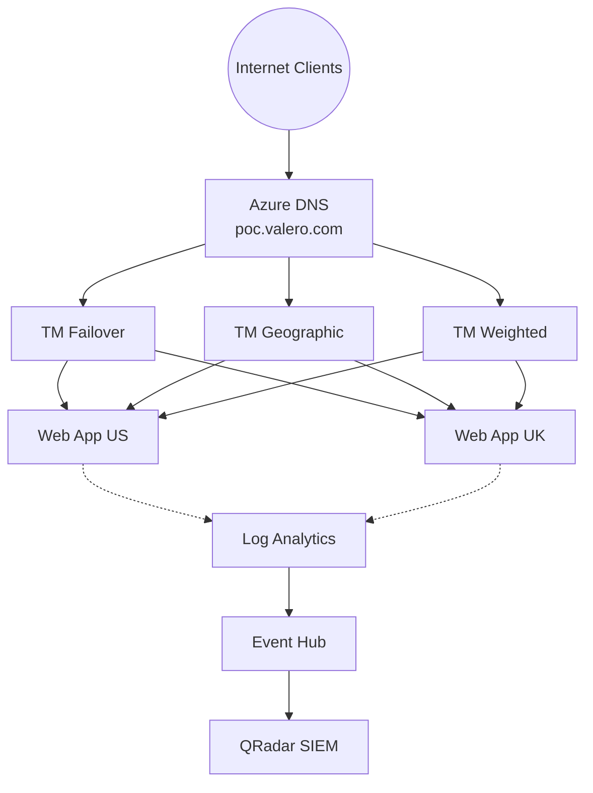

# Azure DNS POC — Solution Accelerator

**Repeatable, production-grade deployment kit for Azure DNS Proof of Concept engagements.**

Built from the Valero Energy Corporation engagement. Parameterized for any customer.

---

## What's in This Repo

| File | Purpose |
|------|---------|
| **Valero_DNS_POC_Deployment.ps1** | End-to-end deployment script (1,580 lines, 15 sections). Deploys all Azure infrastructure, tested live with 14 findings fixed. |
| **Valero_DNS_POC_Cleanup.ps1** | Tear-down script. Removes all resources in correct dependency order (locks → DNSSEC → RBAC → RG). |
| **DNS_POC_Architecture.drawio** | Architecture diagram (open in draw.io or VS Code draw.io extension). |
| **DNS_POC_Solution_Accelerator_Discovery.md** | Discovery document — kimvaddi.com reference architecture analysis + Valero gap mapping. |
| **sample-bind-zone.txt** | Sample Bind zone file (RFC 1035) with all record types for zone import testing. |
| **Valero_Azure_DNS_POC_Plan.md** | Full POC scope, 3-phase timeline, success scorecard, risks, competitive positioning. |
| **Valero_DCV_Walkthrough_Guide.md** | Beginner-friendly DCV + certificate workflow guide for customer engineers. |
| **Valero_DNS_POC_Runbook.sh** | Original bash runbook (13 sections). Superseded by the PowerShell deployment script. |
| **Valero_DNS_POC_Scoping_Session_Agenda.md** | 60-minute scoping session agenda with decision templates. |
| **DNS_POC_Core Ask from the Customer.txt** | Raw customer requirements (source of truth). |
| **Valero DNS POC Scope _3_25_2026.txt** | Workstream catalog from March 25 scoping session. |
| **.github/copilot-instructions.md** | Copilot workspace instructions for AI-assisted development. |

---

## Quick Start

### Prerequisites

- Azure CLI installed (`az --version`)
- Logged in (`az login`)
- Subscription with Owner/Contributor access
- Customer provides: domain name, Bind zone files, registrar access, DigiCert access

### Deploy

```powershell
# 1. Edit Section 0 variables
code Valero_DNS_POC_Deployment.ps1

# 2. Run section by section (copy-paste into PowerShell)
# Each section has a VERIFY step — confirm before moving on
```

### Clean Up

```powershell
# After POC is complete
.\Valero_DNS_POC_Cleanup.ps1
# Type 'DELETE' when prompted
```

---

## What Gets Deployed

```
Resource Group: rg-dns-poc
├── Azure DNS Zone (public) + DNSSEC
├── Private DNS Zone + VNet Link + sample records
├── VNet (10.0.0.0/16)
├── Event Hub (Standard SKU) + QRadar SAS policies + consumer group
├── Log Analytics Workspace (30-day retention)
├── Storage Account (QRadar checkpoint)
├── Traffic Manager × 3 (Priority, Geographic, Weighted)
├── App Service Plan × 2 (West US 3, East Asia)
├── Web App × 2 (dotnet:8, httpsOnly, FTP disabled)
├── Custom RBAC role (DNS Record Operator)
├── Resource lock (CanNotDelete on DNS zone)
├── Diagnostic settings (8 Activity Log categories + webapp + TM logs)
└── Optional: Azure Front Door (commented out)
```

---

## POC Scope Coverage

### Required (All Must Pass)

| # | Workstream | Script Section | Tested? |
|---|-----------|---------------|---------|
| 1 | Zone Migration (Bind import) | Section 2 | ✅ 23/23 records |
| 2 | Audit Logging (Activity Log → Event Hub → QRadar) | Section 3 | ✅ 8 categories |
| 3 | Reporting (Log Analytics + Workbooks) | Section 7.5 | ✅ |
| 4 | Zone Snapshots (export + re-import) | Section 8 | ✅ |
| 5 | Certificate Integration (DCV) | Section 5 | ✅ 5 tests |

### Optional

| # | Workstream | Script Section | Tested? |
|---|-----------|---------------|---------|
| 6 | DNS Failover | Section 6+7 (Priority TM) | ✅ |
| 7 | Weighted Load Balancing | Section 6+7 (Weighted TM) | ✅ |
| 8 | Geographic DNS | Section 6+7 (Geographic TM) | ✅ |
| 9 | API Support (CRUD) | Section 2.7 (CLI + Bicep + REST) | ✅ |
| 10 | DNSSEC | Section 9 | ✅ |

---

## Deployment Findings (14 Issues Found & Fixed)

See the script header for the complete list. Key findings:

1. Azure DNS public zones **do not support query-level logging** (management plane only)
2. Event Hub **must be Standard SKU** (Basic doesn't support consumer groups/SAS policies)
3. QRadar needs **4 Azure resources** (Send policy, Listen policy, consumer group, storage account)
4. CNAME TTL defaults to **3600s** — must be set to **30s** for fast failover
5. Web apps default to **httpsOnly=false** — must enable explicitly

---

## Architecture



---

## Customization

The script is parameterized — edit Section 0 to swap for any customer:

| Parameter | Default | Customer Sets |
|-----------|---------|--------------|
| `$DOMAIN` | poc.valero.com | ✅ |
| `$RG_NAME` | rg-dns-poc | ✅ |
| `$LOCATION_PRIMARY` | westus3 | ✅ |
| `$LOCATION_SECONDARY` | eastasia | ✅ |
| `$EH_NAMESPACE` | ehns-dns-poc | ✅ |
| `$WEBAPP_US` | webapp-poc-us | ✅ |
| `$WEBAPP_UK` | webapp-poc-uk | ✅ |

---

## Security

- Least-privilege SAS policies (Send/Listen separated)
- Custom RBAC role (DNS Record Operator — records only, no zone create/delete)
- RBAC-based Event Hub access (Azure Event Hubs Data Sender/Receiver)
- HTTPS-only web apps, FTP disabled, TLS 1.2 minimum
- Resource lock on DNS zone (CanNotDelete)
- Root SAS key rotated post-deployment
- 10-item production hardening checklist in script

---

## Author

**Kim Vaddi** — Microsoft Account Team  
Built with GitHub Copilot, March 27, 2026  
Tested in subscription: MCAPS-Hybrid-REQ-118274-2025-kimvaddi
