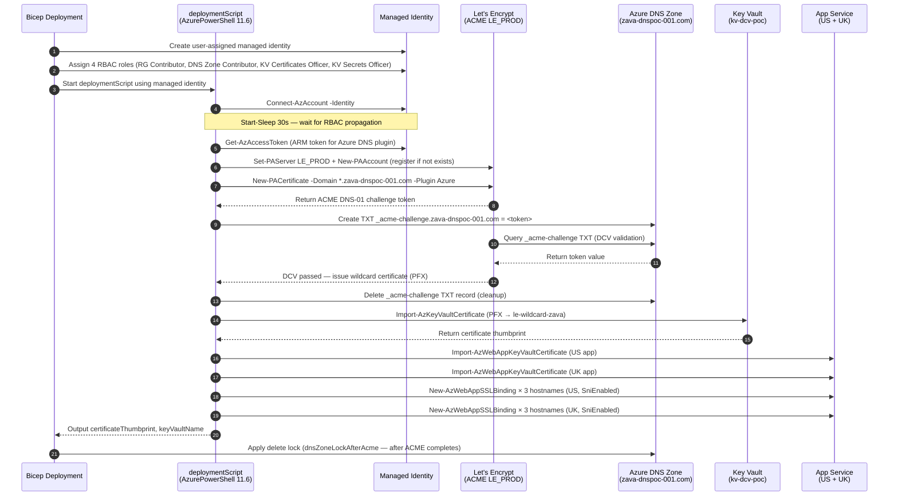

# Zava DNS POC — Let's Encrypt ACME Automation

**Audience:** Jeremy, Matt, Mike — DNS and Azure practitioners new to ACME automation  
**Purpose:** Deep-dive reference for the fully automated certificate lifecycle: ACME DNS-01 challenge → Let's Encrypt issuance → Key Vault import → App Service TLS binding — implemented entirely through the Bicep deployment  
**Scope:** `infrastructure/modules/lets-encrypt-automation.bicep` and its integration in `infrastructure/main.bicep`

---

## 1. What This Automation Does

When `enableLetsEncryptAutomation = true` is set in the deployment parameters, the deployment:

1. Creates an Azure Key Vault to store certificates securely.
2. Creates a User-Assigned Managed Identity for the automation.
3. Assigns four RBAC roles to the identity (least-privilege).
4. Runs a PowerShell `deploymentScript` inside Azure that:
   - Connects to Let's Encrypt production via ACME.
   - Performs DNS-01 Domain Control Validation (DCV) using the Azure DNS plugin.
   - Issues a wildcard certificate for `*.zava-dnspoc-001.com`.
   - Imports the certificate (PFX) into Key Vault.
   - Imports the certificate into both App Services.
   - Binds SNI TLS to each of the three custom hostnames on both App Services.

No local tooling (certbot, acme.sh, Posh-ACME CLI) needs to be installed on any engineer's workstation — everything runs inside Azure.

---

## 2. Architecture

```
  Bicep Deployment (az deployment sub create)
  │
  ├─ Key Vault (RBAC mode)
  │    └─ Certificate: le-wildcard-zava
  │
  ├─ User-Assigned Managed Identity
  │    ├─ Contributor       → Resource Group rg-dns-poc
  │    ├─ DNS Zone Contributor → zava-dnspoc-001.com
  │    ├─ KV Certificates Officer → Key Vault
  │    └─ KV Secrets Officer      → Key Vault
  │
  └─ deploymentScript (AzurePowerShell 11.6)
       │
       ├─ 1. Connect-AzAccount -Identity
       │         ↓
       ├─ 2. Install / import Posh-ACME module
       │         ↓
       ├─ 3. Set-PAServer LE_PROD  →  Let's Encrypt production ACME endpoint
       │         ↓
       ├─ 4. New-PAAccount (register ACME account if not exists)
       │         ↓
       ├─ 5. Acquire ARM token (via managed identity)
       │         ↓
       ├─ 6. New-PACertificate -Domain *.zava-dnspoc-001.com -Plugin Azure
       │    │
       │    │  Posh-ACME Azure plugin:
       │    │    a. Creates TXT record: _acme-challenge.zava-dnspoc-001.com
       │    │    b. Let's Encrypt queries the TXT record (DCV)
       │    │    c. Let's Encrypt issues certificate
       │    │    d. Plugin deletes the TXT record
       │    │
       │         ↓
       ├─ 7. Import-AzKeyVaultCertificate  →  Key Vault (PFX → KV certificate)
       │         ↓
       ├─ 8. Import-AzWebAppKeyVaultCertificate  →  App Service (webapp-poc-us-*)
       │    Import-AzWebAppKeyVaultCertificate  →  App Service (webapp-poc-uk-*)
       │         ↓
       └─ 9. New-AzWebAppSSLBinding (3 domains × 2 apps = 6 SNI bindings)
                  webfailover.zava-dnspoc-001.com  → SniEnabled
                  webgeo.zava-dnspoc-001.com       → SniEnabled
                  webweighted.zava-dnspoc-001.com  → SniEnabled
```

### Process Sequence Diagram



---

## 3. What Is ACME DNS-01 DCV?

**DCV (Domain Control Validation)** is the proof-of-ownership check a Certificate Authority (CA) requires before issuing a certificate. The ACME protocol (RFC 8555) defines several challenge types. This deployment uses **DNS-01**.

### How DNS-01 Works

```
1. Automation requests cert for *.zava-dnspoc-001.com from Let's Encrypt
2. Let's Encrypt returns a challenge:
     "Create TXT record: _acme-challenge.zava-dnspoc-001.com = <random-token>"
3. Posh-ACME Azure plugin creates that TXT record via the Azure DNS API
4. Let's Encrypt queries DNS and confirms the token value matches
     → Domain ownership is proven (DCV passed)
5. Let's Encrypt issues the wildcard certificate
6. Posh-ACME Azure plugin deletes the _acme-challenge TXT record
7. Certificate PFX is available locally in the deployment script environment
```

### Why DNS-01 for Wildcards?

The ACME HTTP-01 challenge (placing a file at `http://domain/.well-known/`) cannot validate wildcard certificates (`*.example.com`). DNS-01 is the only ACME challenge type that works for wildcards. Since the POC uses a single wildcard cert to cover all three Traffic Manager hostnames, DNS-01 is the correct choice.

### Comparison Table

| Challenge Type | Works for Wildcards | Requires Running Server | Used Here |
|---|---|---|---|
| HTTP-01 | No | Yes | No |
| DNS-01 | **Yes** | No | **Yes** |
| TLS-ALPN-01 | No | Yes | No |

---

## 4. Azure Resources Created

| Resource Type | Name Pattern | Purpose |
|---|---|---|
| Key Vault | `kv-dcv-poc` (or param value) | Stores the issued certificate |
| User-Assigned Managed Identity | `id-le-acme-<uniqueString>` | Authentication identity for script |
| Role Assignment × 4 | guid-based deterministic names | RBAC for DNS, KV, and RG access |
| deploymentScript (AzurePowerShell) | `deploy-letsencrypt-<uniqueString>` | The automation execution container |

### RBAC Roles Assigned

| Role | Scope | Why It's Needed |
|---|---|---|
| Contributor | Resource Group | Import certificate into App Service |
| DNS Zone Contributor | `zava-dnspoc-001.com` | Create/delete ACME challenge TXT record |
| Key Vault Certificates Officer | Key Vault | Import and read certificates in KV |
| Key Vault Secrets Officer | Key Vault | Access private key material (PFX) |

All roles are assigned to the managed identity only — not to any user or service principal. This follows least-privilege and avoids storing credentials anywhere in the deployment.

---

## 5. Parameters

These parameters in `infrastructure/main.bicepparam` control the automation:

| Parameter | Type | Example Value | Description |
|---|---|---|---|
| `enableLetsEncryptAutomation` | bool | `true` | Enables the full ACME flow |
| `letsEncryptContactEmail` | string | `'dmauser@hotmail.com'` | Email for ACME account registration |
| `keyVaultName` | string | `'kv-dcv-poc'` | Key Vault name to create/use |
| `letsEncryptCertificateName` | string | `'le-wildcard-zava'` | Certificate name inside Key Vault |
| `letsEncryptRunTag` | string | `'run-1'` | Change this value to force re-execution |
| `enableCustomDomainTls` | bool | `true` | Preserves SNI bindings on redeploy |
| `customDomainCertificateThumbprint` | string | `'8652E63...'` | Thumbprint of current bound cert |
| `enableDnsZoneLock` | bool | `true` | Applies delete lock after ACME completes |

### Key Vault Unique Naming

Key Vault names are globally unique across all Azure customers. If two deployments share the same `keyVaultName`, the second deployment will fail.

**Bicep default** (when `keyVaultName` is not set):
```bicep
param keyVaultName string = 'kvdns${take(uniqueString(subscription().subscriptionId, resourceGroup().id), 18)}'
```

For this environment, `keyVaultName = 'kv-dcv-poc'` is set explicitly in `main.bicepparam`.

---

## 6. DNS Zone Lock Ordering

This is an important sequencing detail. The DNS zone has a delete lock enabled (`enableDnsZoneLock = true`) to prevent accidental record deletion during the POC. However, the ACME automation also needs to **delete** the `_acme-challenge` TXT record after validation. If the lock is applied before the ACME script completes, the cleanup step fails.

`main.bicep` handles this with two conditional lock modules:

```
Case 1: enableDnsZoneLock = true, enableLetsEncryptAutomation = false
  → dnsZoneLockNoAcme applies lock immediately (no ACME script running)

Case 2: enableDnsZoneLock = true, enableLetsEncryptAutomation = true
  → dnsZoneLockAfterAcme applies lock only after letsEncryptAutomation module completes
```

This ensures the lock is never blocking the ACME DNS API calls.

---

## 7. Force Rerun / Certificate Renewal

Azure `deploymentScripts` cache outputs by default. If the script has already run successfully, redeployment will skip it unless the `forceUpdateTag` changes.

To force the ACME script to rerun (for renewal or debugging), change the `letsEncryptRunTag` value in `main.bicepparam`:

```bicep
param letsEncryptRunTag = 'run-2'   // was 'run-1'
```

Then redeploy. The script will run again, request a fresh certificate from Let's Encrypt, update Key Vault, and rebind all App Services.

### Let's Encrypt Certificate Lifetime

Let's Encrypt certificates expire after **90 days**. Posh-ACME will renew automatically if the remaining validity is less than 30 days (configurable). In this deployment, renewal is triggered by changing `letsEncryptRunTag` and redeploying — no external scheduler is required for the POC. For production, a scheduled pipeline or Function App would trigger this automatically.

---

## 8. Running the Deployment

### Step 1: Prerequisites

```powershell
# Authenticate to Azure
az login

# Set the correct subscription
az account set --subscription 43d55e51-58fe-486f-9e2a-ba56b8dd15de

# Confirm the active subscription
az account show --query "{subscription:name, id:id}" -o table
```

### Step 2: Validate Parameters

Confirm these are set correctly in `infrastructure/main.bicepparam`:

```bicep
param deployWebApps                 = true
param enableLetsEncryptAutomation   = true
param letsEncryptContactEmail       = 'dmauser@hotmail.com'
param keyVaultName                  = 'kv-dcv-poc'
param letsEncryptCertificateName    = 'le-wildcard-zava'
param letsEncryptRunTag             = 'run-1'     // increment to force renewal
param enableDnsZoneLock             = true
```

### Step 3: Build and Validate Template

```powershell
az bicep build --file infrastructure/main.bicep
```

Expected output: no errors, `infrastructure/main.json` updated.

### Step 4: What-If (Recommended Before First Run)

```powershell
az deployment sub what-if `
  --name dns-poc-le-whatif `
  --location southcentralus `
  --template-file infrastructure/main.bicep `
  --parameters infrastructure/main.bicepparam
```

Review the planned changes. The deployment script resource will appear as a new resource.

### Step 5: Deploy

```powershell
az deployment sub create `
  --name dns-poc-le-deploy `
  --location southcentralus `
  --template-file infrastructure/main.bicep `
  --parameters infrastructure/main.bicepparam
```

Expected elapsed time: **15–25 minutes** (ACME DNS propagation + certificate issuance + App Service binding accounts for most of the wait).

---

## 9. Post-Deployment Verification

Run all of these after deployment completes.

### Verify Certificate in Key Vault

```powershell
az keyvault certificate list `
  --vault-name kv-dcv-poc `
  --query "[].{name:name,thumbprint:x509ThumbprintHex,expires:attributes.expires}" `
  -o table
```

Expected: `le-wildcard-zava` present with a thumbprint and expiration ~90 days out.

### Verify SNI Bindings on US App

```powershell
az webapp config hostname list `
  -g rg-dns-poc `
  --webapp-name webapp-poc-us-yjpkzjlqt4dou `
  --query "[?contains(name,'zava-dnspoc-001.com')].{hostname:name,ssl:sslState,thumbprint:thumbprint}" `
  -o table
```

Expected `sslState` for each hostname: `SniEnabled`.

### Verify SNI Bindings on UK App

```powershell
az webapp config hostname list `
  -g rg-dns-poc `
  --webapp-name webapp-poc-uk-yjpkzjlqt4dou `
  --query "[?contains(name,'zava-dnspoc-001.com')].{hostname:name,ssl:sslState,thumbprint:thumbprint}" `
  -o table
```

### Verify HTTPS Is Working (End-to-End)

```powershell
$domains = @(
  'webfailover.zava-dnspoc-001.com',
  'webgeo.zava-dnspoc-001.com',
  'webweighted.zava-dnspoc-001.com'
)
foreach ($h in $domains) {
  try {
    $r = Invoke-WebRequest -Uri ('https://' + $h) -Method Head -TimeoutSec 20 -UseBasicParsing
    Write-Output "$h -> HTTP $($r.StatusCode)"
  } catch {
    Write-Output "$h -> FAILED: $($_.Exception.Message)"
  }
}
```

Expected: all three return `HTTP 200`.

### Confirm _acme-challenge Record Was Cleaned Up

```powershell
Resolve-DnsName -Name '_acme-challenge.zava-dnspoc-001.com' -Type TXT
```

Expected: `NXDOMAIN` or no record (the challenge TXT is removed after DCV completes — this confirms cleanup ran correctly).

### Confirm No Pending _acme-challenge Record via Azure DNS

```powershell
az network dns record-set txt list `
  -g rg-dns-poc `
  -z zava-dnspoc-001.com `
  --query "[?contains(name,'_acme-challenge')]" `
  -o table
```

Expected: empty output (no residual records).

---

## 10. Troubleshooting

### ACME challenge cleanup fails with lock error

**Symptom:** `deploymentScript` fails with an authorization error on TXT record deletion.  
**Cause:** DNS zone lock applied before the ACME script completed (should not happen with current `main.bicep`).  
**Fix:** Verify `enableDnsZoneLock = true` is set. Current `main.bicep` uses `dnsZoneLockAfterAcme` which `dependsOn` the ACME module — recheck that the module was not edited.

### Certificate not imported to App Service

**Symptom:** Key Vault shows the certificate, but `az webapp config hostname list` shows `sslState: Disabled`.  
**Cause 1:** RBAC role assignment propagation lag (usually a few seconds; the script has a 30-second sleep guard).  
**Cause 2:** Transient App Service API error.  
**Fix:** Increment `letsEncryptRunTag` and redeploy to force script rerun.

### Only one App Service bound

**Symptom:** US app has SNI bindings but UK app does not (or vice versa).  
**Cause:** Transient failure partway through the binding loop.  
**Fix:** Increment `letsEncryptRunTag` and redeploy.

### No certificate created (5 retries exhausted)

**Symptom:** `deploymentScript` fails with `Let's Encrypt certificate issuance did not produce a PFX file`.  
**Cause:** DNS propagation delay or Let's Encrypt API transient error during all 5 retries.  
**Fix:** Wait a few minutes and redeploy with a new `letsEncryptRunTag`.

### Key Vault name already exists

**Symptom:** Bicep deployment fails with `VaultAlreadyExists` or `ConflictError`.  
**Cause:** Key Vault names are globally unique. The chosen name is taken by another subscription.  
**Fix:** Change `keyVaultName` to a different value and redeploy. The Bicep default uses `uniqueString()` to avoid this automatically.

### ARM token is null

**Symptom:** Script fails with `Unable to acquire ARM token for Posh-ACME Azure DNS plugin`.  
**Cause:** Managed identity RBAC assignments were not propagated before the script began.  
**Fix:** The script includes `Start-Sleep -Seconds 30` after `Connect-AzAccount -Identity` for this reason. If it still fails, increase the sleep value in `lets-encrypt-automation.bicep` and redeploy.

---

## 11. Current Environment State

These reflect the live state as of the last verified deployment:

| Item | Value |
|---|---|
| DNS zone | `zava-dnspoc-001.com` |
| Resource group | `rg-dns-poc` |
| Key Vault | `kv-dcv-poc` |
| Certificate name | `le-wildcard-zava` |
| Current thumbprint | `8652E6320D9C23BD85AB6FC2450C918A1AA5DCA6` |
| US App Service | `webapp-poc-us-yjpkzjlqt4dou` |
| UK App Service | `webapp-poc-uk-yjpkzjlqt4dou` |
| Bound hostnames | `webfailover.zava-dnspoc-001.com`, `webgeo.zava-dnspoc-001.com`, `webweighted.zava-dnspoc-001.com` |
| SSL state | `SniEnabled` on all 6 hostname/app combinations |
| HTTPS status | HTTP 200 on all three domains |

---

## 12. Files Reference

| File | Role |
|---|---|
| [infrastructure/modules/lets-encrypt-automation.bicep](infrastructure/modules/lets-encrypt-automation.bicep) | Core ACME module: KV, identity, RBAC, deploymentScript |
| [infrastructure/main.bicep](infrastructure/main.bicep) | Invokes module, wires params, manages DNS lock ordering |
| [infrastructure/main.bicepparam](infrastructure/main.bicepparam) | Environment-specific parameter values |
| [infrastructure/modules/web-app-hostname-bindings.bicep](infrastructure/modules/web-app-hostname-bindings.bicep) | Binds custom hostnames with optional SNI TLS |
| [DCV_TLS_Deployment_Checklist.md](DCV_TLS_Deployment_Checklist.md) | Quick deployment checklist |
| [Zava_DCV_Walkthrough_Guide.md](Zava_DCV_Walkthrough_Guide.md) | Broader DCV concepts and walkthrough for the team |
